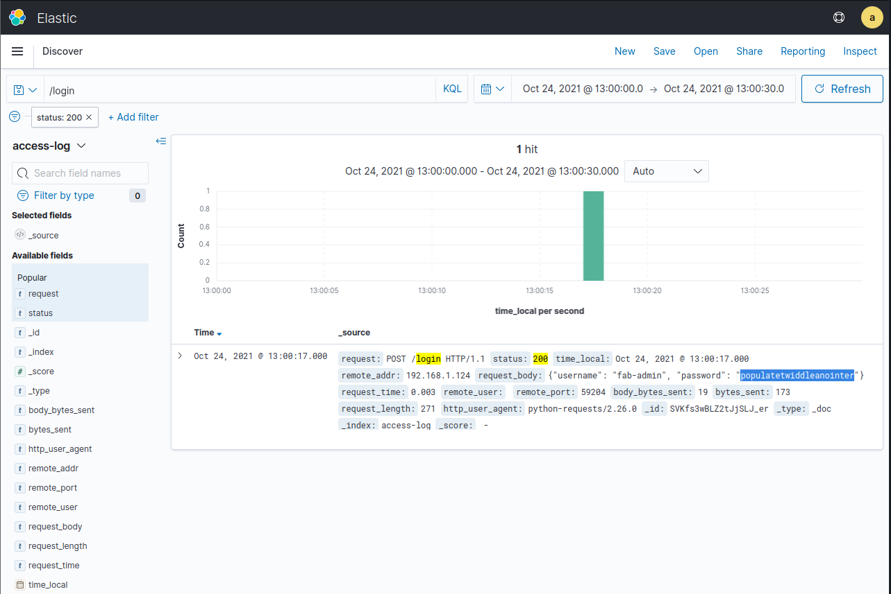

# badfab1

## Challenge

```
We suspect that attackers were able to initially gain access to the network by compromising our semiconductor fabrication plant reporting portal. We've setup a Kibana instance that you can use to analyze some of the access logs.

We think they may have determined the password for one of our users. What was it?

To access Kibana:

Visit http://10.0.1.22:5601/app/login?nextUrl=%2F
Login with the username and password admin
When prompted to Select your tenant choose Global.
You should now be able to view the access logs as well as an Access Log dashboard.
```

## Walkthrough

After logging into the ElasticSearch page I checked the dashboard to get an overview of the situation.


Looking at the 2000 login requests from a single IP address and the amount of `HTTP401`s it's obvious that the hackers managed to bruteforce their way in.

To find out which password was correct I navigated to the discovery page. There I put in a search for all requests to `/login` that returned `HTTP200`.
 


Only 1 successful login!

## Solve

```
username fab-admin
password populatetwiddleanointer
```
