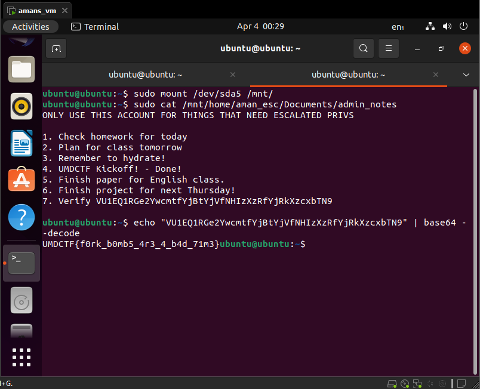

# Amans VM

## Challenge

The flag is hidden somewhere in a Ubuntu VM.

## Walkthrough & Flag

Booting the VM quickly revealed the issue, shortly after booting the vm would become unresponsive as if overloaded. To investigate I added an Ubuntu CD image to the VM and inspected the VMs disk.

Looks like a fork bomb was configured to run on login.