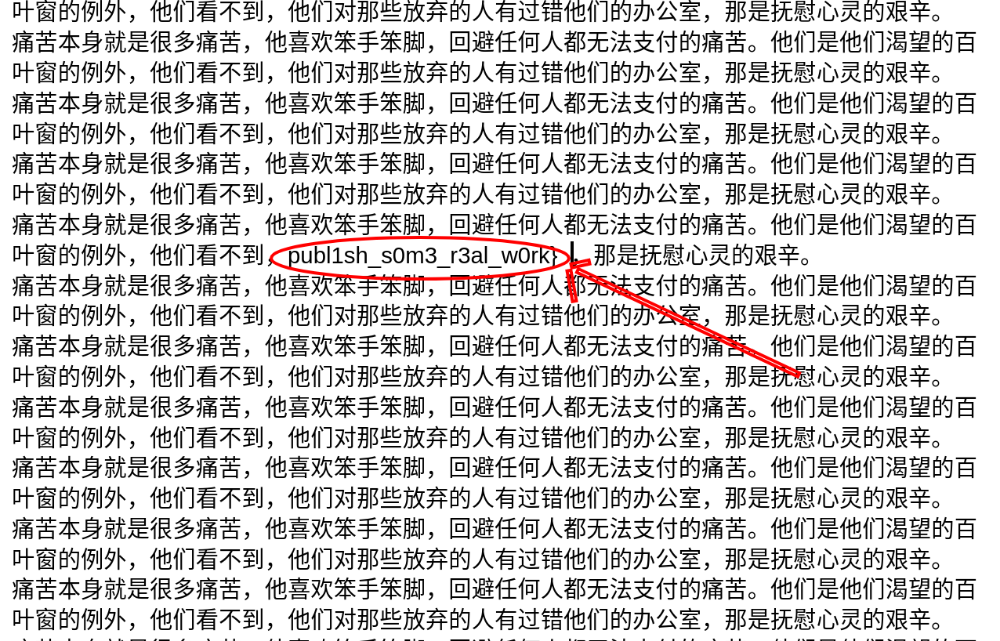

# JData

## Challenge

> Extract the flag from the given binary and image.

## Walkthrough

We were given a `jdata.zip` file, naturally the first step is to extract.

Extracting the zip revealed a `jdata.png` and viewing the image gives you the second half of the flag easily.



To find the first half I the files and found that there was an ELF hidden in the zip archive.

```sh
$ binwalk jdata.zip

DECIMAL       HEXADECIMAL     DESCRIPTION
--------------------------------------------------------------------------------
0             0x0             ELF, 64-bit LSB shared object, AMD x86-64, version 1 (SYSV)
20800         0x5140          Zip archive data, at least v2.0 to extract, compressed size: 329834, uncompressed size: 341046, name: jdata.png
350780        0x55A3C         End of Zip archive, footer length: 22
```

Unfortunately the ELFs glibc version was so blazing new that even Debian testing didn't have it.

```sh
$ ./jdata.zip
./jdata.zip: /lib/x86_64-linux-gnu/libc.so.6: version `GLIBC_2.34' not found (required by ./jdata.zip)
```

After [installing the latest glibc](./install_glibc_234.sh) I popped open gdb to inspect the binary and found the flag. Despite the simple obfuscation method I found it rather effective since `gdb` turned my brain onto reversing mode rather than forensics.

```sh
pwndbg> info functions
0x0000000000001169  main
0x0000000000001489  hehe
0x0000000000001616  a
0x0000000000001625  b
0x0000000000001634  c
...
0x000000000000176f  x
0x000000000000177e  y
0x000000000000178d  z
pwndbg> disassemble hehe # read this bottom up
...
   0x00000000000015c2 <+313>:   call   0x179c <brack> # umdctf{
...
   0x00000000000015ce <+325>:   call   0x1661 <f> # umdctf
...
   0x00000000000015da <+337>:   call   0x1733 <t> # umdct
...
   0x00000000000015e6 <+349>:   call   0x1634 <c> # umdc
...
   0x00000000000015f2 <+361>:   call   0x1643 <d> # umd
...
   0x00000000000015fe <+373>:   call   0x16ca <m> # um
...
   0x000000000000160a <+385>:   call   0x1742 <u> # u
   0x000000000000160f <+390>:   mov    eax,0x0
   0x0000000000001614 <+395>:   pop    rbp
   0x0000000000001615 <+396>:   ret
```

## Solve

`umdctf{ghidraisforbinariesbroandpubl1sh_s0m3_r3al_w0rk}`
